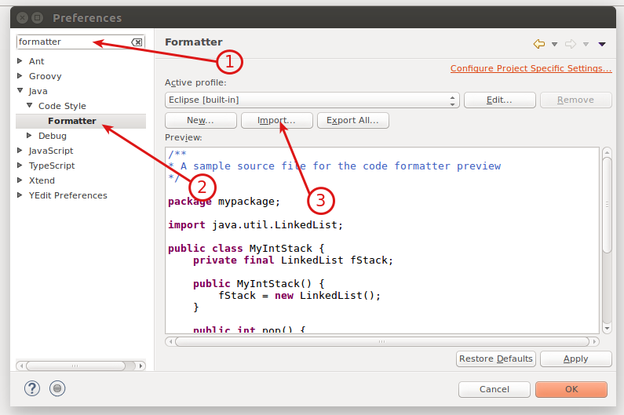
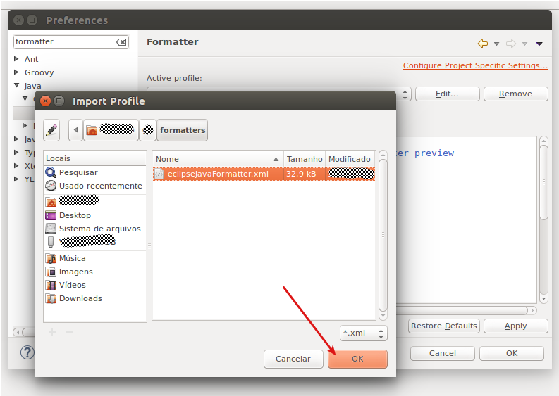
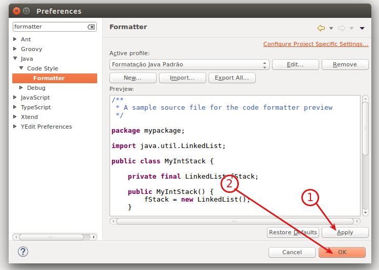

# Description

Every time I install a eclipse IDE or switch between computers, I lose my java format styles, so I decide to save and share;

The formatters are used try to conseve good code readablility.

Feel free to use, or make suggestions.

# Installing

You will need to clone this repository firstly.

Inside eclipse IDE go to **Window/preferences**, in preferences, wite *formatter* on searchbox (1).

Click to expand on **Java**, **Code Style**, **Formatter** (2), see image below.

Click on **Import** button (3), see image below.

 On **Import profile** screem, select the file **eclipseJavaFormatter.xml** from the cloned repository, see image below.

With file imported, just click on **Apply** (1) and **Save**, see image below.

It's done, now you can use this formatter inside your IDE.
